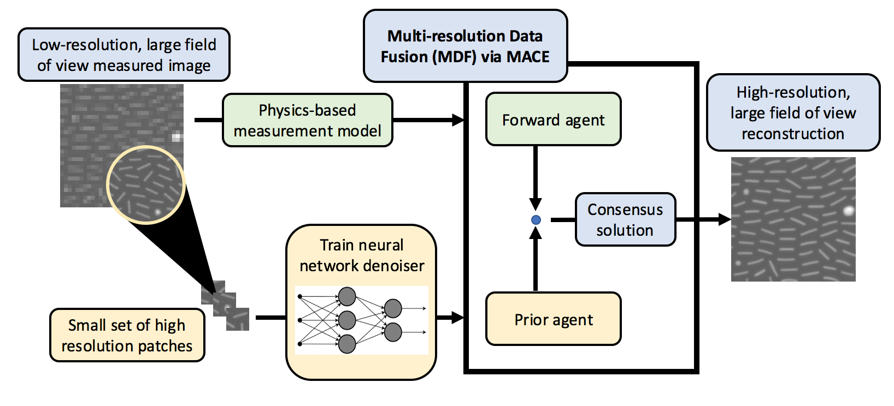

# Multi-Resolution Data Fusion (MDF)
ReadMe last updated on March 2nd, 2021



Contributors:
Emma J. Reid (Purdue University), Charles A. Bouman (Purdue University), Gregery T. Buzzard (Purdue University), Lawrence F. Drummy (AFRL-RXAS), Cheri M. Hampton (AFRL-RXAS),  and Asif Mehmood (AFRL-RYAT)

## Overview:
Applications in materials and biological imaging are currently limited by their ability to collect large areas of high resolution data in practical amounts of time. One possible solution to this problem is to collect low-resolution data and apply a super-resolution interpolation algorithm to produce a high-resolution image.  However, state-of-the-art super-resolution algorithms are typically designed for natural images, require aligned pairing of high and low resolution training data for optimal performance, and do not directly incorporate a data-fidelity mechanism.

In this repository, we provide code for a Multi-Resolution Data Fusion (MDF) algorithm for accurate interpolation of low-resolution TEM data by factors of 4x and 8x. This MDF interpolation algorithm achieves these high rates of interpolation by first learning an accurate prior model denoiser for the TEM sample from small quantities of unpaired high-resolution data and then balancing this learned denoiser with a novel mismatched proximal map that maintains fidelity to measured data. The method is based on Multi-Agent Consensus Equilibrium (MACE), a generalization of the Plug-and-Play method, and it allows for interpolation at arbitrary resolutions without retraining. We include electron microscopy results at 4x and 8x super resolution that exhibit reduced artifacts relative to existing methods while maintaining fidelity to acquired data and accurately resolving sub-pixel-scale features.

Our datasets are extracted from microscopy images of pentacene crystals, gold nanorods, and E. coli collected by AFRL's Soft Matter Materials Branch (RXAS). This repository contains scripts, networks, and supplemental code for accomplishing multi-resolution data fusion (MDF). However the general framework can used for other image modalities, provided the user retrains the prior models.

## Dependencies:
* Python 3.7

Run the following code to set up a virtual environment with our dependencies: 

  ```
  conda create -n envname python=3.7
  conda activate envname
  pip install -r requirements.txt
  ```

Note that pip install torch has issues on Windows, so you may need to acquire this through other means.

## Provided Code:

### Demos:
We provide 2 demos, macedemo.py and mdfdemo.py. In macedemo.py, we create a synthetic LR image using decimation and attempt to reconstruct the high resolution ground truth using a DnCNN prior trained on natural images. This demo is useful as it easily allows for you to use metrics like PSNR or SSIM. In mdfdemo.py, we perform the same reconstruction using a MDF prior. 

### Paper Figures:
We provide the parameters and input images needed to replicate our paper results for MACE and MDF in the paper-params. These may be used as inputs to macedemo.py for reproducibility. We additionally provide scripts for DPSR and ESRGAN that can be used to generate those images. 

### Training:
We provide the exact code used for training our MDF priors in the training folder. We used the DnCNN code provided at (https://github.com/cszn/KAIR) for training our priors, but the framework is meant to be flexible enough to work with any denoiser of your choice. The code in our models folder is directly from the aforementioned repository. If you run the main_train_dncnn.py file present there, you will train a DnCNN model on our 2 nm gold nanorods dataset. To change the dataset to one of your own, add the data folder to the "/trainsets/" folder and update the "train_dncnn_*.json" file in /options/ accordingly. For any other questions on training, please refer to the KAIR repository. 

## Prior Options:
Our prior models are neural networks using the DnCNN structure trained to remove 10% Additive White Gaussian Noise from specific microscopy materials. You may select which prior you'd like to use out of those provided in the priors folder. We currently provide prior models for E. coli, gold nanorods, and pentacene crystals. You may additionally train your own priors for use.

### References:
[1](https://arxiv.org/abs/1612.00874) S. Sreehari et al. "Multi-resolution Data Fusion for Super-Resolution Electron Microscopy". In: Computer Vision and Pattern Recognition (2017)

[2](https://arxiv.org/abs/1705.08983) G. Buzzard et al. “Plug-and-Play Unplugged: Optimization-Free  Reconstruction  Using  Consensus  Equilibrium”.In:SIAM  Journal  on  Imaging  Sciences11.3  (2018),pp.  2001–2020

[3](https://arxiv.org/abs/1906.06601) Soumendu Majee et al. “4D X-Ray CT Reconstructionusing  Multi-Slice  Fusion”. In: International Conference on Computational Photography (2019)

[4](https://arxiv.org/abs/1608.03981) K. Zhang et al. “Beyond a Gaussian Denoiser: Resid-ual Learning of Deep CNN for Image Denoising”. In:IEEE  Transactions  on  Image  Processing26.7  (July2017), pp. 3142–3155.

[5](https://github.com/cszn/KAIR) KAIR GitHub Code Repository - used their DnCNN training code.

